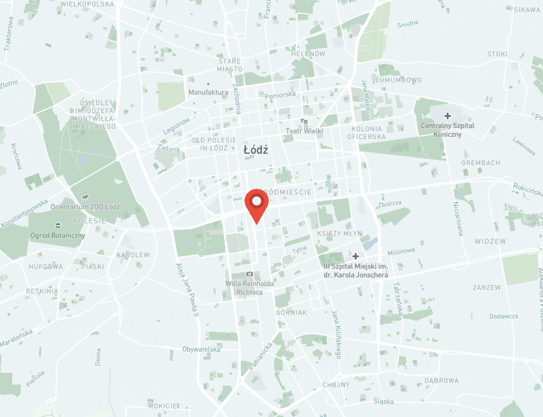

# Mapbox Web Component

This is a simple Mapbox Web component that allow you to show map with point on your page. It should support any web page
or framework like Angular, Vue, React and others.

### Required
- Mapbox token, check how to get the [token](https://docs.mapbox.com/help/getting-started/access-tokens/)
### Optional
- Mapbox [style](https://docs.mapbox.com/api/maps/styles/)
- Marker icon - you can provide your icon or use a build-in icon

# Usage with `node_module`
## Installation
```bash
npm install mapbox-map-web-component
```

## Import
```bash
import 'mapbox-map-web-component'
```
## Use

```html

<div style="height: 100vh; width: 100%">
  <map-box-map
    width="100%"
    height="100%"
    access-token="<YOUR-TOKEN>"
    marker-width="60px"
    marker-height="60px"
  ></map-box-map>
</div>
```

Example in Vue
```vue
<map-box-map
  width="100%"
  height="500px"
  access-token="<YOUR-TOKEN>"
  zoom="11"
  marker-width="80px"
  marker-height="80px"
  :lng="location[0]"
  :lat="location[2]"
  marker-url="src/assets/markers/marker.png"
></map-box-map>
```



# Usage with HTML file

## Import
```html
<script type="module" src="https://unpkg.com/mapbox-map-web-component@latest"></script>
```
## Example
```html
<!DOCTYPE html>
<html dir="ltr" lang="en">
<head>
  <meta charset="utf-8" />
  <meta name="viewport" content="width=device-width, initial-scale=1.0, minimum-scale=1.0, maximum-scale=5.0" />
  <title>Stencil Component Starter</title>

  <script type="module" src="https://unpkg.com/mapbox-map-web-component@latest"></script>
</head>
<body>
<div style="height: 100vh; width: 100%">
  <map-box-map
    width="100%"
    height="100%"
    access-token="<YOUR-TOKEN-HERE>"
    marker-width="60px"
    marker-height="60px"
  ></map-box-map>
</div>
</body>
</html>

```

## Configuration Options

Below are the configuration properties available for the library/component. You can customize these to suit your application's needs.

| Property        | Type              | Default Value | Description                                                                                      |
|-----------------|-------------------|---------------|--------------------------------------------------------------------------------------------------|
| `marker-url`    | `string`          | `undefined`   | URL for the marker icon to be used on the map. If not provided, a default icon is used. Sometimes restricted (e.g., ViteFS, see [reference](https://vite.dev/config/server-options.html#server-fs-allow)). |
| `marker-width`  | `string`          | `'50px'`      | Specifies the width of the marker in pixels.                                                    |
| `marker-height` | `string`          | `'50px'`      | Specifies the height of the marker in pixels.                                                   |
| `height`        | `string`          | `'100%'`      | Represents the height of the map (supported CSS values).                                         |
| `width`         | `string`          | `'100%'`      | Represents the width of the map (supported CSS values).                                          |
| `access-token`  | `string`          | `undefined`   | Mapbox access token (mandatory for Mapbox functionality). See [Mapbox guide](https://docs.mapbox.com/help/getting-started/access-tokens/).           |
| `map-style`     | `string`          | `undefined`   | URL of the Mapbox style. See [Map Styles](https://docs.mapbox.com/api/maps/styles/). |
| `lng`           | `number`          | `19.457216`   | Longitude coordinate of the map's center.                                                      |
| `lat`           | `number`          | `51.759445`   | Latitude coordinate of the map's center.                                                       |
| `zoom`          | `number`          | `11`          | Map's initial zoom level (min: 0, max: 15).                                                    |

### Example Configuration

Here’s an example of how you can configure the component:

```tsx
<map-box-map
  width="80%"
  height="600px"
  access-token="your-access-token"
  map-style="mapbox://styles/mapbox/streets-v11"
  lng="10.7522"
  lat="59.9139"
  zoom="12"
  marker-url="https://example.com/custom-icon.png"
  marker-width="40px"
  marker-height="60px"
/>
```

### Notes

- **`marker-url`:** If the URL for the custom icon is restricted (e.g., when using Vite), ensure the path is allowed, as explained in the [Vite documentation](https://vite.dev/config/server-options.html#server-fs-allow).
- **`access-token`:** This is mandatory for the Mapbox functionality. Ensure you obtain your token from [Mapbox](https://docs.mapbox.com/help/getting-started/access-tokens/)).


# Created with Stencil [![Built With Stencil](https://img.shields.io/badge/-Built%20With%20Stencil-16161d.svg?logo=data%3Aimage%2Fsvg%2Bxml%3Bbase64%2CPD94bWwgdmVyc2lvbj0iMS4wIiBlbmNvZGluZz0idXRmLTgiPz4KPCEtLSBHZW5lcmF0b3I6IEFkb2JlIElsbHVzdHJhdG9yIDE5LjIuMSwgU1ZHIEV4cG9ydCBQbHVnLUluIC4gU1ZHIFZlcnNpb246IDYuMDAgQnVpbGQgMCkgIC0tPgo8c3ZnIHZlcnNpb249IjEuMSIgaWQ9IkxheWVyXzEiIHhtbG5zPSJodHRwOi8vd3d3LnczLm9yZy8yMDAwL3N2ZyIgeG1sbnM6eGxpbms9Imh0dHA6Ly93d3cudzMub3JnLzE5OTkveGxpbmsiIHg9IjBweCIgeT0iMHB4IgoJIHZpZXdCb3g9IjAgMCA1MTIgNTEyIiBzdHlsZT0iZW5hYmxlLWJhY2tncm91bmQ6bmV3IDAgMCA1MTIgNTEyOyIgeG1sOnNwYWNlPSJwcmVzZXJ2ZSI%2BCjxzdHlsZSB0eXBlPSJ0ZXh0L2NzcyI%2BCgkuc3Qwe2ZpbGw6I0ZGRkZGRjt9Cjwvc3R5bGU%2BCjxwYXRoIGNsYXNzPSJzdDAiIGQ9Ik00MjQuNywzNzMuOWMwLDM3LjYtNTUuMSw2OC42LTkyLjcsNjguNkgxODAuNGMtMzcuOSwwLTkyLjctMzAuNy05Mi43LTY4LjZ2LTMuNmgzMzYuOVYzNzMuOXoiLz4KPHBhdGggY2xhc3M9InN0MCIgZD0iTTQyNC43LDI5Mi4xSDE4MC40Yy0zNy42LDAtOTIuNy0zMS05Mi43LTY4LjZ2LTMuNkgzMzJjMzcuNiwwLDkyLjcsMzEsOTIuNyw2OC42VjI5Mi4xeiIvPgo8cGF0aCBjbGFzcz0ic3QwIiBkPSJNNDI0LjcsMTQxLjdIODcuN3YtMy42YzAtMzcuNiw1NC44LTY4LjYsOTIuNy02OC42SDMzMmMzNy45LDAsOTIuNywzMC43LDkyLjcsNjguNlYxNDEuN3oiLz4KPC9zdmc%2BCg%3D%3D&colorA=16161d&style=flat-square)](https://stenciljs.com)

Stencil is a compiler for building fast web apps using Web Components.

Stencil combines the best concepts of the most popular frontend frameworks into a compile-time rather than runtime tool.
Stencil takes TypeScript, JSX, a tiny virtual DOM layer, efficient one-way data binding, an asynchronous rendering
pipeline (similar to React Fiber), and lazy-loading out of the box, and generates 100% standards-based Web Components
that run in any browser supporting the Custom Elements v1 spec.

Stencil components are just Web Components, so they work in any major framework or with no framework at all.

## Getting Started

To start building an own version of this web component, clone this repo to a new directory:

```bash
git clone https://github.com/DawidRyczko/map-box-web-component.git
cd map-box-web-component
```

and run:

```bash
npm install
npm start
```

To build the component for production, run:

```bash
npm run build
```

To run the unit tests for the components, run:

```bash
npm test
```

Need help? Check out our docs [here](https://stenciljs.com/docs/my-first-component).
